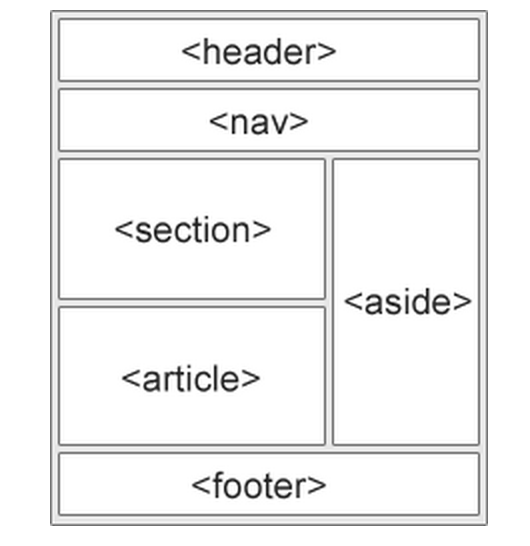

# udacity-fewd-nanodegree
Udacity Front-end Web Developer Nanodegree

## References

### Resources

* [Udacity Frontend Nanodegree Style Guide](http://udacity.github.io/frontend-nanodegree-styleguide/)

### HTML

* [MDN HTML Reference](https://developer.mozilla.org/en-US/docs/Web/HTML/Reference)
* [MDN HTML Developer Guide](https://developer.mozilla.org/en-US/docs/Web/Guide/HTML)
* [HTML validator](http://validator.w3.org/#validate_by_input)
* [Content sectioning](https://developer.mozilla.org/en-US/docs/Web/HTML/Element#Content_sectioning)
* [Sections and Outlines of an HTML5 Document - The HTML5 Outline Algorithm](https://developer.mozilla.org/en-US/docs/Web/Guide/HTML/Sections_and_Outlines_of_an_HTML5_document#The_HTML5_Outline_Algorithm)
* [Organization of Schemas](http://schema.org/docs/schemas.html)
* [The viewport meta tag](https://developer.mozilla.org/en-US/docs/Mozilla/Mobile/Viewport_meta_tag)
* [Benefits of HTML5 and Semantic Markup](https://www.webmechanix.com/advantages-of-html5-and-semantic-markup)

### CSS

* [MDN CSS Reference](https://developer.mozilla.org/en-US/docs/Web/CSS/Reference)
* [MDN CSS Developer Guide](https://developer.mozilla.org/en-US/docs/Web/Guide/CSS)
* [CSS Media Queries](https://developer.mozilla.org/en-US/docs/Web/CSS/Media_Queries/Using_media_queries)
* [List of CSS properties](http://www.w3.org/community/webed/wiki/CSS/Properties)
* [CSS validator](http://jigsaw.w3.org/css-validator/#validate_by_input)
* [CSS minifier](http://cssminifier.com/)
* [Responsive data table](https://css-tricks.com/responsive-data-table-roundup/)
* [Responsive images](https://developers.google.com/web/fundamentals/design-and-ui/media/images/)
* [normalize.css](http://necolas.github.io/normalize.css/)
* [Default style sheet for HTML 4](http://www.w3.org/TR/CSS21/sample.html)
* Default CSS rules: [WebKit (Chrome and Safari)](http://trac.webkit.org/browser/trunk/Source/WebCore/css/html.css), [FireFox](http://hg.mozilla.org/mozilla-central/file/tip/layout/style/html.css), [Internet Explorer](http://www.iecss.com/)
* Flex information: [Flex](https://developer.mozilla.org/en-US/docs/Web/CSS/flex), [Flex-wrap](https://developer.mozilla.org/en-US/docs/Web/CSS/flex-wrap), [A complete guide to Flexbox](https://css-tricks.com/snippets/css/a-guide-to-flexbox/)

* [MDN Web APIs (events and event propagation)](https://developer.mozilla.org/en-US/docs/Web/API/Document_Object_Model/Examples#Example_5:_Event_Propagation)

### Frameworks

* [Bootstrap](http://getbootstrap.com/)
* [Foundation](http://foundation.zurb.com/)
* [Yaml](http://www.yaml.de/)
* [960 Grid](http://960.gs/)
* [Suzy](http://susy.oddbird.net/)
* [Frameless Grid](http://www.jonikorpi.com/frameless/)
* [HTML 5 Boilerplate](https://html5boilerplate.com/)

### Fonts

* [MDN CSS Font Reference](https://developer.mozilla.org/en-US/docs/Web/CSS/font)
* [Font Awesome](http://fortawesome.github.io/Font-Awesome/)
* [Unicode character table](http://unicode-table.com/en/)
* [Google Fonts](https://www.google.com/fonts)

### Tools

* [Sublime Text](http://www.sublimetext.com/)
* [JetBrains WebStorm](https://www.jetbrains.com/webstorm/)
* [CodePen](http://codepen.io/)
* [Chrome Device Emulator](https://developer.chrome.com/devtools/docs/device-mode)
* [BrowserStack](https://www.browserstack.com/)
* [Google Chrome Canary](https://www.google.com/intl/en/chrome/browser/canary.html)
* [Chromium Dev channel](http://www.chromium.org/getting-involved/dev-channel)
* [iOS WebKit Debug Proxy](https://github.com/google/ios-webkit-debug-proxy)
* Placeholders: [Placehold.it](http://placehold.it/), [Placepuppy.it](http://placepuppy.it/), [placekitten](http://placekitten.com/), [lorempixel](http://lorempixel.com/)
* Task Runners: [Grunt](http://gruntjs.com/), [Gulp](http://gulpjs.com/)

### Important information

* [Remote Debugging on Android with Chrome](https://developer.chrome.com/devtools/docs/remote-debugging)
* [Difference between display:non and visibility:hidden](http://webdesign.about.com/od/css/f/blfaqhidden.htm)

### Guide to layout semantic tags

